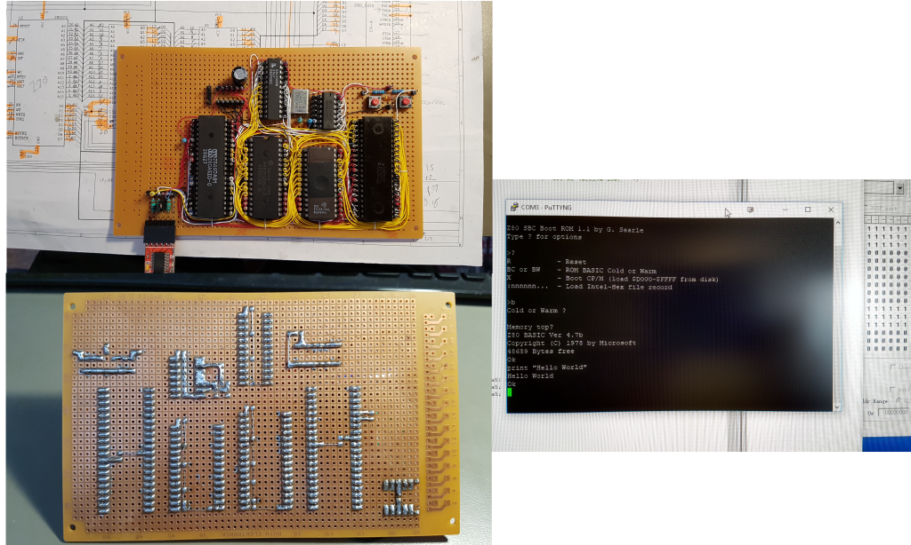
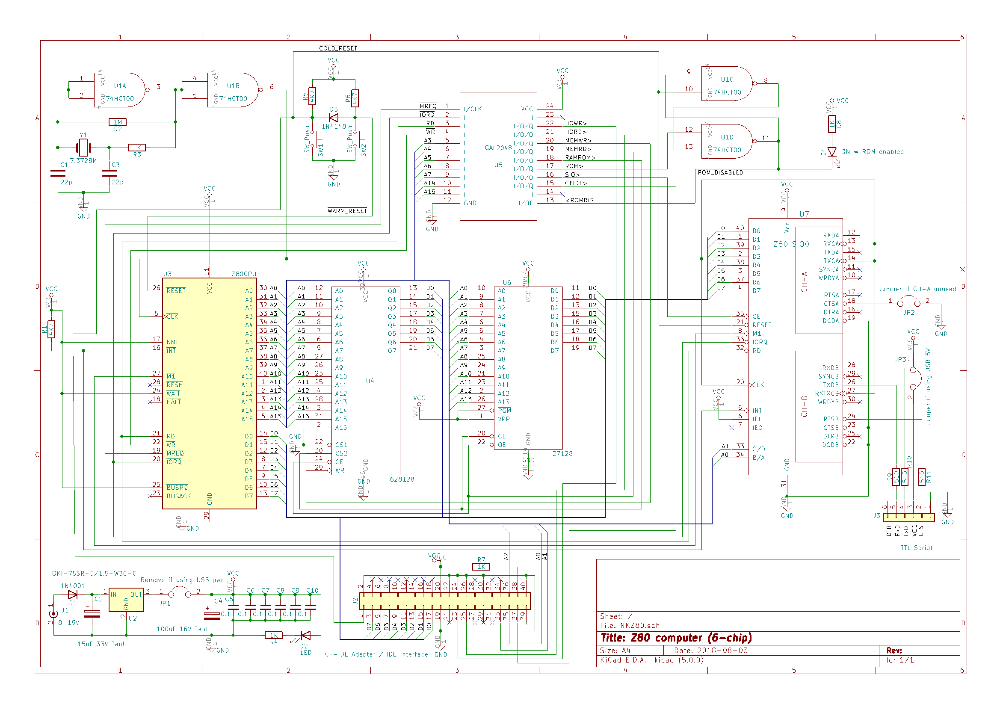
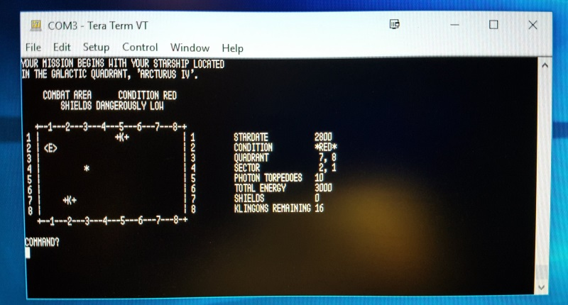

# Z80-Board
Z80 computer wirewrapped on perfboard

This Z80 board was inspired by Grant Searle's "9-chip" design - but using a GAL for most of the glue logic takes the chip count to 6! This board does not yet have the compact flash/IDE interface fitted. For more details of what the board can do, see Grant's original documentation:

Original inspiration: http://searle.hostei.com/grant/cpm/index.html

More pictures here: https://imgur.com/a/rGRR2NM

# Schematic

# Components

These parts were used for initial testing:

* Mostek MK3880N-4 (4Mhz Z80 CPU - NMOS)
* Zilog Z80SIO/0 (Z8440AB1 - NMOS)
* TMS27C128-25 EPROM
* HM628128 1M (128Kx8) SRAM ('half-used' as in the original design - probably because the part is cheap or was to hand)
* 74HCT00 Quad NAND gate - this MUST be an 74HCT part; the clock circuit is not likely to work with anything else (74LS, HC etc.)
* Lattice GAL20V8B-25LP - programmed using a TL866II device programmer/tester

The GAL needs programming - I used the low-cost TL866 'universal programmer' (IMPORTANT: Untick 'Encrypt Ch' otherwise the GAL may not program correctly). The .JED file is ready to upload to the programmer. If you want to edit/change the source .PLD file, you will need a copy of WinCUPL (free from https://www.microchip.com/design-centers/programmable-logic/spld-cpld/tools/software/wincupl) or another CUPL editor.

The board in the photo is powered via the USB-to-TTL adapter, drawing a current of about 170mA - which is probably pushing the poor adapter a tad. Substituting CMOS parts for the CPU and SIO will reduce supply current; using a CMOS Z80 brings the load down to 100mA.

If you use a discrete 5V supply for the board, remember to keep the GND/0V line of the USB-TTL adapter connected but disconnect its 5V line - do not try to use two power sources at the same time.

You may find that the USB-TTL adapter resets when plugged into the board; this seems to be due to the inrush current. 

Because 4Mhz parts were used to test the design, this board is fitted with a 3.6864Mhz crystal and the serial interface runs at 57,600BPS. If faster spec parts are used then the board should run at the original clock speed of 7.3728Mhz, with a serial speed of 115,200BPS. You might get away with overclocking a 4Mhz Z80 CPU (for a while at least!), but the SIO chips are more fussy. 

# Bonus Games

Modified to work on this platform and Microsoft Z80 BASIC Ver 4.7b

SUPER STARTREK

The classic SUPER STARTREK from 1978. The main changes were to restrict line lengths and/or split long lines into multiples, re-writing the conditional statements accordingly, and to remove the print-formatting 'USING' command, which is not supported. 

The main program is STARTREK.BAS. TRKINST.BAS prints the instructions and in the original program was chain-loaded upon request,  but that feature has not been implemented so it's best to just read the source if you need guidance.

MAZE

Draws an ASCII maze (eventually, for big ones!)

BUNNY

ASCII bunny (well, 'Rabbit' now)

ELIZA

Early AI - Let Eliza sort out your troubles (not to be taken seriously)

all code loads via Tera Term using its copy-and-paste feature. PuTTY causes buffer overflows.

Let me know if anything needs further modification...and enjoy some retro gaming!

### More Pictures

Details of the wirewrapping and then showing the addition of an I/O port - circuit very similar to https://rc2014.co.uk/modules/digital-io/

